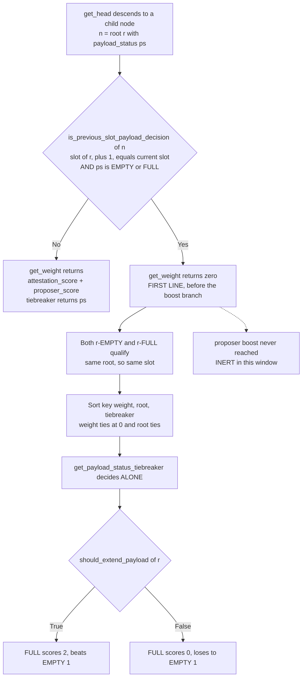
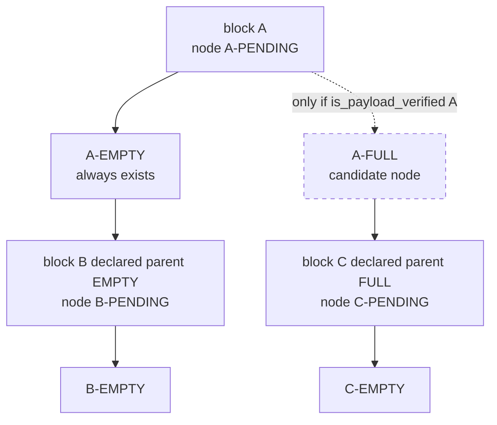
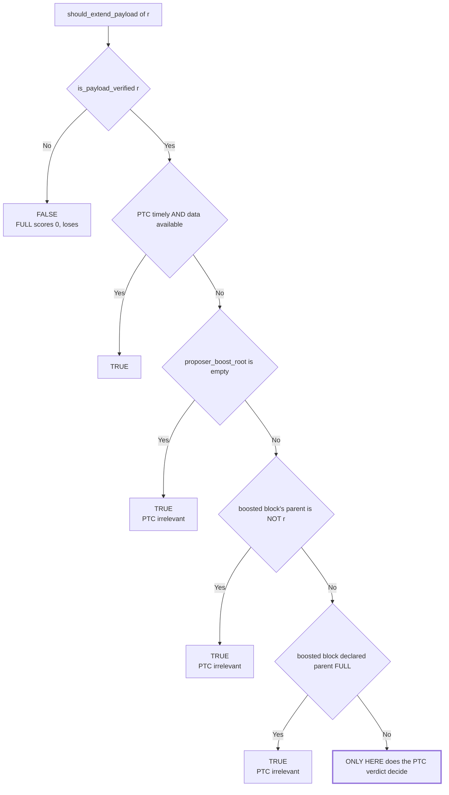
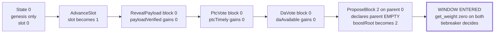

# The PTC verdict is the sole decider of a previous-slot payload status

A characterisation of `get_head` behaviour in `specs/gloas/fork-choice.md`
(EIP-7732), with a machine-checked witness.

**This is not a bug report.** It is a precise statement of a mechanism the spec
already implements, plus one consequence that is not obvious from reading any
single function. Everything below is checkable against the spec file in a few
minutes; the witness exists to show a model actually reaches the state, not to
establish the reading.

---

## Claim

> For a block `r` whose slot is exactly one less than the current slot, the fork
> choice between `(r, FULL)` and `(r, EMPTY)` is decided **entirely** by
> `get_payload_status_tiebreaker`. Attestation weight and proposer boost cannot
> influence it, because `get_weight` returns zero for both nodes.

Consequence, which is the part worth flagging: **proposer boost is inert inside
this window.** Not merely outweighed — never evaluated.



The dotted edge is the consequence: the early return in `get_weight` precedes the
`is_ancestor(proposer_boost_node, node)` branch entirely.

## The structure this rests on: fork-choice nodes are not blocks

Gloas fork choice descends a tree of `(root, payload_status)` **nodes**, not
blocks. Every block contributes a PENDING node, which yields an EMPTY node
always and a FULL node only when the payload is verified. A child block then
attaches to **exactly one** of those two, according to the parent status it
declared when it was signed.



Two consequences that matter for the claim:

- A block never attaches to both branches. `get_node_children` filters children
  by `get_parent_payload_status`, which is read from the child's own body and is
  therefore fixed at signing time.
- The PTC verdict does not add weight anywhere. It determines whether the FULL
  node **exists as a candidate**, and then which of the two wins the tiebreak.

---

## Derivation

Three functions, quoted verbatim.

```python
def is_previous_slot_payload_decision(store: Store, node: ForkChoiceNode) -> bool:
    is_previous_slot = store.blocks[node.root].slot + 1 == get_current_slot(store)
    is_payload_decision = node.payload_status in [PAYLOAD_STATUS_EMPTY, PAYLOAD_STATUS_FULL]
    return is_previous_slot and is_payload_decision
```

```python
def get_weight(store: Store, node: ForkChoiceNode) -> Gwei:
    if is_previous_slot_payload_decision(store, node):
        return Gwei(0)
    ...
    proposer_score = Gwei(0)
    proposer_boost_node = ForkChoiceNode(
        root=store.proposer_boost_root, payload_status=PAYLOAD_STATUS_PENDING)
    if is_ancestor(store, proposer_boost_node, node):
        proposer_score = get_proposer_score(store)
    return attestation_score + proposer_score
```

```python
def get_payload_status_tiebreaker(store: Store, node: ForkChoiceNode) -> Uint8:
    if is_previous_slot_payload_decision(store, node):
        if node.payload_status == PAYLOAD_STATUS_EMPTY:
            return 1
        if should_extend_payload(store, node.root):
            return 2
        return 0
    else:
        return node.payload_status
```

And `get_head`'s sort key:

```python
head = max(children, key=lambda child: (
    get_weight(store, child), child.root,
    get_payload_status_tiebreaker(store, child)))
```

Step by step:

1. `(r, EMPTY)` and `(r, FULL)` share a root, hence a slot. If `r.slot + 1 ==
   current_slot`, then `is_previous_slot_payload_decision` holds for **both** —
   both payload statuses are in `[EMPTY, FULL]`.
2. `get_weight` therefore returns `Gwei(0)` for both, on its first line. The
   proposer-boost branch is unreachable for these nodes.
3. The first two components of the sort key are equal: weight `0`, and the same
   `root`.
4. So `max` is resolved by the third component alone.
5. `get_payload_status_tiebreaker` gives `EMPTY = 1`, and `FULL = 2` if
   `should_extend_payload(store, r)` else `0`.

**FULL is selected iff `should_extend_payload(r)`. Otherwise EMPTY wins, 1 > 0.**

## When `should_extend_payload` actually depends on the PTC

```python
def should_extend_payload(store: Store, root: Root) -> bool:
    assert store.blocks[root].slot + 1 == get_current_slot(store)
    if not is_payload_verified(store, root):
        return False
    proposer_root = store.proposer_boost_root
    payload_is_timely = payload_timeliness(store, root, timely=True)
    payload_data_is_available = payload_data_availability(store, root, available=True)
    return (
        (payload_is_timely and payload_data_is_available)
        or proposer_root == Root()
        or store.blocks[proposer_root].parent_root != root
        or is_parent_node_full(store, store.blocks[proposer_root])
    )
```

Four disjuncts. Three are independent of the PTC and all three are permissive.
The committee's verdict is load-bearing only when all three are false:

- `proposer_boost_root != Root()`, **and**
- the boosted block's parent **is** `root`, **and**
- the boosted block declared its parent **EMPTY**.



The three `PTC irrelevant` exits are why the window is narrow: the committee's
verdict is load-bearing only when the current proposer built directly on `r`
**and** declared its payload EMPTY.

In plain terms: the PTC verdict decides only when the current proposer built
directly on `root` and declined its payload. Everywhere else the payload is
extended regardless of what the committee said.

---

## Machine-checked witness

TLA+ model of the Gloas fork choice over `(root, payload_status)` nodes, checked
with Apalache 0.61.0. The probe asserts the tiebreak is *never* decisive; it is
violated, and the violation is the witness.

```
apalache-mc check --cinit=ConstInit --init=Init --next=NextWitness \
                  --inv=VAC_P3_TiebreakDecisive --length=7 MCEPBSMultiSlotV2.tla
# VIOLATED, witness found at State 5, 3037 s
```

Witness state:

```
blocks          = {0, 2}          blockSlot     = {0 |-> 0, 2 |-> 1}
blockParent     = {2 |-> 0}       parentStatus  = {2 |-> EMPTY}
slot            = 1
payloadVerified = ptcTimely = daAvailable = {0}
proposer_boost_root = 2           should_apply_proposer_boost = TRUE
head = (0, FULL)                  headPath = {(0,FULL), (0,PENDING)}
latestMsg: all validators at slot 0, present = FALSE   <-- nobody attested
```

The five transitions that reach it, each a real action of the model:



Two things this pins down that the prose above does not:

- **No attestation is required.** The tie is structural, from the zeroing rule,
  not the result of balanced voting.
- **Proposer boost is live and irrelevant.** `should_apply_proposer_boost` is
  TRUE and the boosted block (2) declares genesis EMPTY, so the boost *would*
  route to `(0, EMPTY)` — and never arrives, because `get_weight` returns on its
  first line.

---

## What this does NOT claim

- It does **not** say the PTC governs fork choice generally. It decides the
  payload status of one block, in one window.
- It does **not** identify a vulnerability. No safety or liveness property is
  shown violated.
- The witness is one execution at small bounds: 3 blocks, 3 validators,
  `PROPOSER_SCORE_BOOST` scaled to 2, and 6 of the model's 7 actions. Sound as an
  existence proof — every action is a real transition — and **not** a statement
  about mainnet parameters.
- The model abstracts leaf viability in `filter_block_tree` (the
  justified/finalized checkpoint conditions are not modelled) and does not model
  `on_block`'s timeliness condition, so it grants proposer boost more freely than
  the protocol does. Neither affects this claim, since the boost is inert here.

## Verifying without the model

1. Read `is_previous_slot_payload_decision`. Confirm it holds for both payload
   statuses of one root.
2. Read the first two lines of `get_weight`. Confirm the early return precedes
   the proposer-boost branch.
3. Read `get_payload_status_tiebreaker`. Confirm `EMPTY = 1`, `FULL ∈ {0, 2}`.
4. Read `get_head`'s key tuple. Confirm the third component is reached when the
   first two tie.

The model is only needed for the reachability question — that a state satisfying
all of this occurs in an execution rather than merely being consistent.
