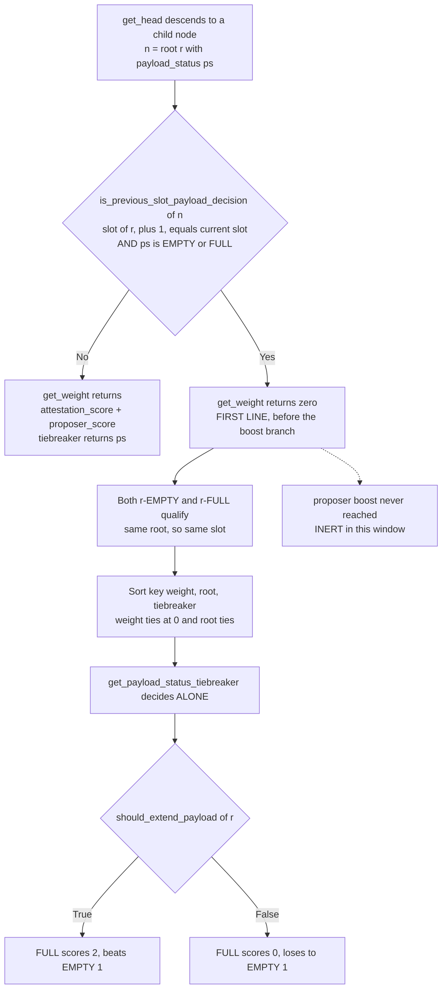
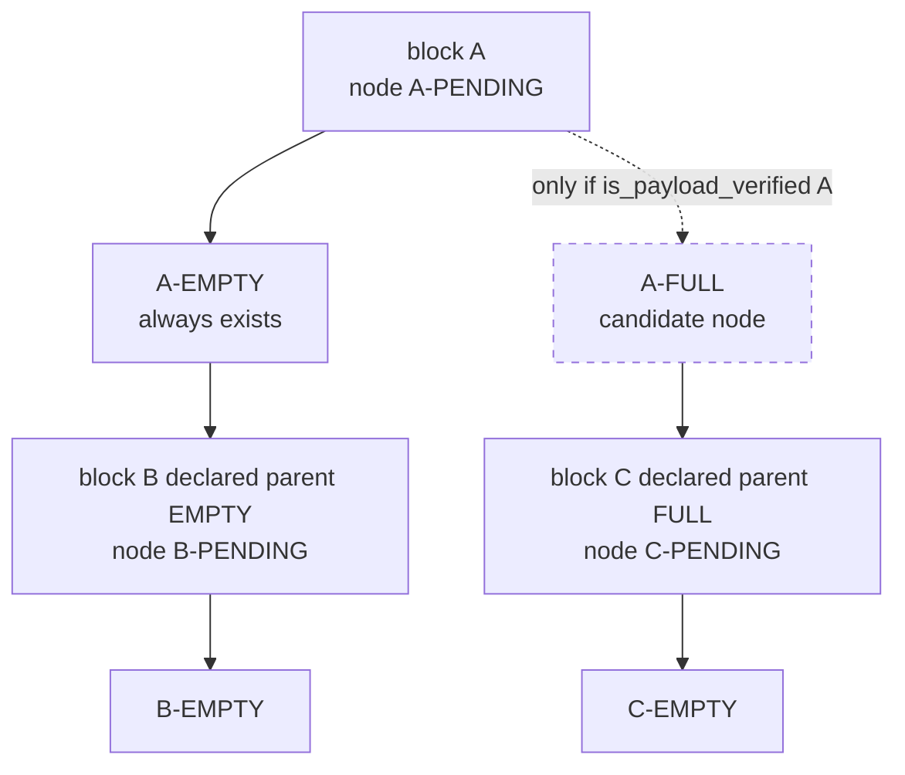

# ePBS Formal Model

[](https://github.com/ss1738/epbs-formal/actions/workflows/verify.yml)


> ## Start here: [`PTC_TIEBREAK_NOTE.md`](PTC_TIEBREAK_NOTE.md)
>
> That note is the current, bounded, spec-checkable finding. Most of this README
> describes v1, which an audit on 2026-08-11 showed is built on a mechanism the
> protocol does not have.
>
> **What was wrong.** Gloas adds **no payload weight** to fork choice.
> `get_weight` returns `attestation_score + proposer_score` and contains no
> payload term. v1 modelled a `PayloadBoost` and measured a reorg threshold over
> it. That predates the ESP submission. See
> [`D5_PAYLOAD_WEIGHT.md`](D5_PAYLOAD_WEIGHT.md).
>
> **What is actually true**, verified against `gloas/fork-choice.md` and
> witnessed by an Apalache trace: payload timeliness enters through *node
> identity*, not weight. For a block one slot old, `get_weight` returns **zero for
> both** its FULL and EMPTY nodes, so `get_head`'s `(weight, root, tiebreaker)`
> key collapses and `get_payload_status_tiebreaker` decides alone. Proposer boost
> is **inert** in that window — never evaluated, because the early return precedes
> the boost branch.
>
> **Removed:** `coq/EPBSForkChoice.v`. It proved a reorg threshold over
> `PayloadBoost` — machine-checked, and about a quantity that does not exist. The
> payment proofs (`coq/EPBSPayment.v`) are unaffected; they do not depend on
> payload weight.
>
> **Archived, not deleted:** `specs/EPBSForkChoice.tla`, `specs/EPBSMultiSlot.tla`,
> `specs/EPBSStub.tla` and [`SCALING_RESPONSE.md`](SCALING_RESPONSE.md) carry
> headers marking them superseded. They are the version of record for what was
> submitted, so the erratum can be checked against them.
>
> | Document | What it is |
> |---|---|
> | [`PTC_TIEBREAK_NOTE.md`](PTC_TIEBREAK_NOTE.md) | **The finding.** Bounded, spec-quoted, machine-checked witness |
> | [`D5_PAYLOAD_WEIGHT.md`](D5_PAYLOAD_WEIGHT.md) | The erratum: why the payload-weight mechanism is phantom |
> | [`V2_VERIFICATION_SPEC.md`](V2_VERIFICATION_SPEC.md) | Measured results, cost curves, and 15 findings including 3 self-inflicted |
> | [`REBUILD_BLUEPRINT.md`](REBUILD_BLUEPRINT.md) | v2 architecture, read function-by-function from `gloas/fork-choice.md` |
>
> ### What is active, what is archived
>
> | Component | Status | Role |
> |---|---|---|
> | `PTC_TIEBREAK_NOTE.md` | **primary** | The finding: bounded, spec-quoted, machine-checked |
> | `specs/EPBSNodes.tla` | **active** | Node algebra on `(root, payload_status)` |
> | `specs/EPBSMultiSlotV2.tla` | **active** | Transitions, adversary, filtered block tree |
> | `specs/MCEPBSNodes.tla`, `specs/MCEPBSMultiSlotV2.tla` | **active** | Apalache harnesses (`ConstInit`, bounds) |
> | `specs/EPBSPTC.tla`, `specs/EPBSChain.tla`, `specs/EPBS.tla` | active, unaffected | Committee timing, chain payments — no payload-weight dependency |
> | `specs/EPBSForkChoice.tla`, `specs/EPBSMultiSlot.tla`, `specs/EPBSStub.tla` | **archived v1** | Carry `PayloadBoost`; headers point at D5 |
> | `SCALING_RESPONSE.md` | **archived** | Record of what was claimed to ESP |
> | `coq/EPBSPayment.v`, `coq/EPBSEquivocation.v` | active | Payment conservation, binding — unaffected by D5 |
> | `coq/EPBSForkChoice.v` | **deleted** | Proved a threshold over `PayloadBoost` |
>
> **Still open:** reorg resistance is unproven — the antecedent needs ≥7 steps and
> the search does not complete at 5 validators. `specs/EPBSPTC.tla`,
> `specs/EPBSChain.tla` and the payment proofs are unaffected by D5.
>
> The CI badge reflects the *old* specs, which still check green. That is the
> problem, not evidence against it.

## The finding, in one diagram

For a block one slot old, `get_weight` returns **zero on both** its payload
nodes, so `get_head`'s `(weight, root, tiebreaker)` key collapses and the
tiebreaker decides alone. Proposer boost is never evaluated.



### Why: fork-choice nodes are not blocks

Gloas descends a tree of `(root, payload_status)` nodes. A block yields a PENDING
node, which yields EMPTY always and FULL only if the payload is verified. Each
child block attaches to exactly one of them, per the parent status fixed in its
own body at signing time. The PTC verdict adds no weight anywhere — it decides
whether the FULL node exists, and which of the two wins the tiebreak.



Full derivation, spec quotes and the machine-checked witness:
[`PTC_TIEBREAK_NOTE.md`](PTC_TIEBREAK_NOTE.md).

---

A machine-checkable formal model of **Enshrined Proposer-Builder Separation (ePBS)** as specified in **[EIP-7732](https://eips.ethereum.org/EIPS/eip-7732)**, the proposer/builder split that Ethereum's Glamsterdam upgrade brings into the consensus protocol itself.

ePBS replaces out-of-protocol relays (MEV-Boost) with in-protocol rules governing how a proposer commits to a builder's block and how the builder is obligated to reveal it. Getting those rules wrong is a consensus-level risk that cannot be rolled back once shipped. This project models the EIP-7732 mechanism (the `SignedExecutionPayloadBid`, the `BuilderPendingPayment` deducted at inclusion, the PTC `payload_present` vote, and the canonical-versus-reorged settlement) and checks its three stated safety guarantees plus liveness, so problems are found before enshrinement rather than after.

The models have been cross-checked against the live executable spec: in `ethereum/consensus-specs`, ePBS is now the **Gloas** fork (`specs/gloas/`). `FIDELITY.md` maps each model element to the Gloas functions and constants (`process_execution_payload_bid`, `payload_timeliness`, `PAYLOAD_TIMELY_THRESHOLD = PTC_SIZE // 2`, the `is_head_weak` / `is_parent_strong` reorg gate) and states the abstraction deltas honestly. Notably, Gloas defines no equivocation slashing, which confirms the model's base choice and the `coq/EPBSEquivocation.v` argument.

## Status

Milestone 1 is done: the single-slot EIP-7732 model is written and has been checked with TLC.

- `specs/EPBS.tla` is a complete single-slot TLA+ model: bidding, payment deducted from the builder at inclusion, builder reveal / withhold / equivocate, a Payload-Timeliness Committee (PTC) vote with a Byzantine minority and a timeliness threshold, canonical-versus-reorged settlement, and pending-payment finalize-or-revert.
- The three EIP-7732 guarantees (proposer unconditional payment, builder reveal safety, builder withhold safety) plus six structural invariants and a liveness property are defined (see `PROPERTIES.md`).
- **TLC checked all of them green** on the finite instance in `specs/EPBS.cfg` (207 distinct states, search depth 8, no errors). The measured run is in `RESULTS.md`. Both the base spec and the optional equivocation-slashing mitigation pass.

Milestone 2 is under way: `specs/EPBSForkChoice.tla` adds an explicit payload-timeliness fork choice and measures the exact weight threshold at which a timely payload becomes reorg-safe. TLC confirms safety above the threshold and returns the reorg counterexample below it, while the payment guarantees hold on both sides. See `MILESTONE2.md`. `specs/EPBSChain.tla` extends the payment lifecycle across a bounded chain of slots with EIP-7732's asynchronous, queued withdrawals, and TLC confirms conservation and liveness (every withdrawal drains) across the whole chain. `specs/EPBSPTC.tla` refines the committee vote from one atomic step into individual, interleaved, timed attestations with lying or abstaining Byzantine members, and TLC proves the timed tally always equals the truth (so the atomic step is a sound abstraction).

Milestone 3 is well under way, with two standalone Coq (Rocq Prover) developments that lift the strongest results from a finite instance to all sizes:

- `coq/EPBSPayment.v` proves the payment core for **all** bid values, **all** balances, and **any** number of builders: conservation, the G1 and G3 payment guarantees, no dangling escrow, and commitment binding.

All are machine-checked theorems with no axioms or admitted goals. See `coq/README.md`.

The invariants are shown to have teeth, not to pass vacuously: `specs/EPBS_fault_*.cfg` inject known bugs and TLC catches each with the right invariant (a reorged block that pays the proposer violates G3; a canonical block that always marks the payload committed violates commitment binding). See `MUTATIONS.md`.

Honest scope: the finite TLC runs check the temporal behavior and the adversary on small instances; the Coq proofs generalize the payment, binding, and reorg-threshold results to all sizes. Remaining milestone-3 work is a machine-checked proof of the full multi-slot temporal behavior (liveness across slots, single-slot-finality interactions).

## What it models

One slot, as a state machine over these phases:

```
bidding -> proposing -> revealing -> attesting -> final
```

The safety questions it targets:

| Property | Plain-language question |
|---|---|
| Proposer unconditional payment (G1) | Is the proposer paid even if the builder never reveals? |
| Builder reveal safety (G2) | Is an honest, timely payload actually included under an honest PTC? |
| Builder withhold safety (G3) | If the block is reorged out, is the builder spared the charge? |
| Commitment binding | Can a builder swap in a different payload after inclusion? |
| Equivocation not canonical | Can an equivocated payload become the canonical one? |
| Conservation | Is payment a pure transfer, with nothing minted or burned? |
| Liveness | Does the slot always terminate? |

Note on fidelity: EIP-7732 deliberately has **no slashing** for payload equivocation. The model reflects that (slashing off by default), and includes the EIP's optional slashing mitigation behind a constant so both can be checked. See `PROPERTIES.md`.

## Running it

You need Java and the TLA+ tools (`tla2tools.jar`).

```bash
# from the repo root
java -cp tla2tools.jar tlc2.TLC -config specs/EPBS.cfg specs/EPBS.tla
```

Or open `specs/EPBS.tla` in the TLA+ Toolbox and run the model defined by `specs/EPBS.cfg`.

The configured instance is deliberately small (2 builders, 3 attesters, bid values {1, 2}) so the state space is fully enumerable.

To reproduce every claim in this repository at once, run:

```bash
./verify.sh
```

It runs all four TLC models (the safe ones must pass; the attack config must produce its expected reorg counterexample) and both Coq proofs, and exits non-zero if anything is off. The same script runs in CI on every push (see the badge above).

## Why this project

Ethereum's public roadmap lists ePBS (Glamsterdam) as a near-term L1 change. The Ethereum Foundation funds open-source research that strengthens the protocol's foundations, and formal verification of consensus changes is squarely in scope. This model is offered as a public good under the MIT license.

## Layout

```
specs/EPBS.tla                    milestone 1: single-slot EIP-7732 model
specs/EPBS.cfg                    its TLC configuration
specs/EPBSForkChoice.tla          milestone 2: fork-choice / reorg-threshold model
specs/EPBSForkChoice.cfg          safe parameters (payload never reorged)
specs/EPBSForkChoice_attack.cfg   unsafe parameters (reorg counterexample)
specs/EPBSChain.tla               multi-slot chain: queued withdrawals + liveness
specs/EPBSChain.cfg               its TLC configuration (3 slots)
specs/EPBSPTC.tla                 per-attester timed PTC votes; tally correctness
specs/EPBSPTC.cfg                 its TLC configuration (3 attesters)
specs/EPBSWeightPayment.tla       Gloas weight-quorum payment settlement
specs/EPBSWeightPayment.cfg       its TLC configuration
specs/EPBS_fault_*.cfg            non-vacuity self-tests (injected bugs TLC must catch)
coq/EPBSPayment.v                 milestone 3: Coq proof of the payment core (all sizes)
coq/EPBSEquivocation.v            Coq proof that equivocation is self-punishing (no slashing needed)
coq/EPBSCommittee.v               Coq proof of PTC tally correctness for all committee sizes
coq/EPBSChain.v                   Coq proof of chain conservation for all chain lengths
coq/EPBSWeightPayment.v           Coq proof of weight-quorum payment for all committee sizes
coq/README.md                     what the Coq developments prove
THREAT_MODEL.md                   adversary coverage matrix vs EIP-7732
MUTATIONS.md                      non-vacuity: injected bugs are caught by the right invariant
CHEATSHEET.md                     maps every proof/model to the Gloas spec element it validates
FIDELITY.md                       how the models map to the real EIP-7732
SCALING.md                        the properties hold at larger instances too
specs/*_large.cfg                 larger TLC configurations (scaling evidence)
verify.sh                         one command that runs every check
.github/workflows/verify.yml      CI: runs verify.sh on every push
RESULTS.md                        the measured milestone-1 TLC run
MILESTONE2.md                     the fork-choice result and reorg threshold
PROPERTIES.md                     the milestone-1 invariant catalog
MILESTONES.md                     the delivery plan
PROPOSAL.md                       the grant / office-hours brief
```

## License

MIT. See `LICENSE`.
