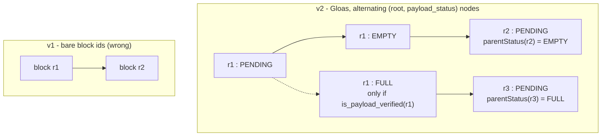
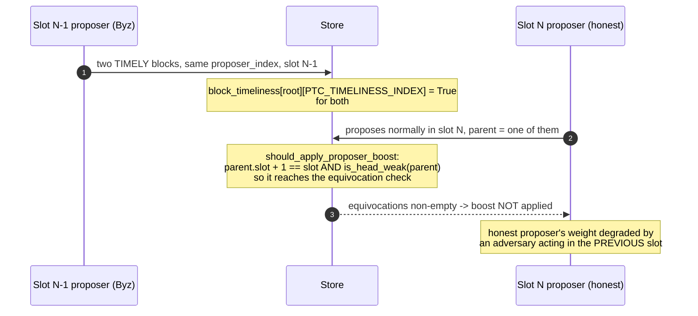

# EPBSMultiSlot v2 — architectural blueprint

Written against `specs/gloas/fork-choice.md` fetched to
`.cache/specs/gloas-fork-choice.md`, not from recall. Every mechanism below quotes
the function it models. The previous model's central defect (D5) came from
designing a mechanism that felt right instead of reading one.

---

## 0. What Gloas fork choice actually does

Reading `get_head`, `get_node_children`, `get_weight` and the tiebreakers together
gives a structure materially different from a weighted block tree.

**Nodes are `(root, payload_status)` pairs.** `PAYLOAD_STATUS_EMPTY = 0`,
`FULL = 1`, `PENDING = 2`.

**The tree alternates between two node kinds.** From `get_node_children`:

```
(r, PENDING)  ->  (r, EMPTY)                        always
                  (r, FULL)     iff is_payload_verified(store, r)

(r, EMPTY|FULL) -> (c, PENDING) for each block c with
                     c.parent_root == r
                     AND node.payload_status == get_parent_payload_status(store, c)
```

So one block contributes **two levels** to the fork-choice tree: a payload-status
decision, then a block-extension step. A model whose fork-choice depth equals block
depth is off by a factor of two.



**A child block attaches to exactly ONE of the EMPTY or FULL nodes**, never both.
`get_node_children` filters on `node.payload_status == get_parent_payload_status(
store, c)`, i.e. on what the child *declares* it builds upon. Above, `r2` builds on
the empty branch and `r3` on the full branch, and neither is reachable from the
other. That filter is the mechanism by which a withheld payload orphans its
descendants, and it is why `parentStatus` is a first-class variable in §1.2.

**The PTC never adds weight.** `get_weight` is:

```python
if is_previous_slot_payload_decision(store, node):
    return Gwei(0)
attestation_score = get_attestation_score(store, node, state)
if not should_apply_proposer_boost(store):
    return attestation_score
... proposer_score if is_ancestor(proposer_boost_node, node)
return attestation_score + proposer_score
```

Two consequences the old model missed entirely:

1. **Payload timeliness enters through `is_payload_verified`**, which decides whether
   a FULL node *exists as a candidate*, and through `should_extend_payload`, which
   sets the tiebreaker. Never through weight.
2. **Weight is exactly zero for previous-slot payload decisions.** The EMPTY-vs-FULL
   choice for the previous slot is resolved *entirely by tiebreaker*, with weight
   contributing nothing. This is the single most important mechanism to model and
   the old spec had no representation of it at all.

**Selection is lexicographic**, from `get_head`:

```python
head = max(children, key=lambda c: (get_weight(store, c), c.root,
                                    get_payload_status_tiebreaker(store, c)))
```

Weight, then root, then tiebreaker. Root ordering is a genuine tiebreak level, not
an implementation detail — the old `BlockHash` scramble was closer to correct than
the `lowest id` it replaced, but it belongs at level 2, not fused into weight.

---

## 1. State space: node identity

### 1.1 Types

```tla
CONSTANTS
    \* @type: Set(Str);
    Validators,
    \* @type: Set(Str);
    ByzValidators,
    \* @type: Int;
    MaxSlot,
    \* @type: Int;
    ProposerBoost,
    \* @type: Int;
    PTCThreshold

PENDING == 2
EMPTY   == 0
FULL    == 1

\* A fork-choice node. Apalache handles records well; this is the key type.
\* @typeAlias: node = { root: Int, ps: Int };
```

Blocks stay integer ids. Nodes are records. This keeps `blockParent` and `blockAnc`
as cheap integer structures while making the node algebra explicit.

### 1.2 Variables

```tla
VARIABLES
    \* @type: Int;                  current slot
    slot,
    \* @type: Set(Int);             published block roots
    blocks,
    \* @type: Int -> Int;
    blockSlot,
    \* @type: Int -> Int;
    blockParent,
    \* @type: Int -> Set(Int);      strict ancestors, maintained on creation
    blockAnc,
    \* @type: Set(Int);             roots with a verified payload envelope
    payloadVerified,                \* models store.payloads / is_payload_verified
    \* @type: Int -> Int;           PAYLOAD_STATUS this block claims of its parent
    parentStatus,                   \* models get_parent_payload_status
    \* @type: Int -> Str;           PTC verdict: "none" | "timely" | "untimely"
    ptcVerdict,
    \* @type: Int -> Str;           data availability verdict, separate per spec
    daVerdict,
    \* @type: Str -> { slot: Int, root: Int, present: Bool };
    latestMsg,                      \* store.latest_messages; node derived, see §1.5
    \* @type: Set(Str);             store.equivocating_indices
    equivocators,
    \* @type: Int;                  store.proposer_boost_root, 0 = none
    boostRoot,
    \* @type: $node;                cached head, see §2.2
    head,
    ...
```

**Validators store MESSAGES, not nodes.** An earlier draft of this blueprint had
`votes : Str -> $node`. That was wrong. `LatestMessage` is
`{slot, root, payload_present}` (`gloas:150`) and the node is *derived* per §1.5.
Storing the node directly would freeze a resolution that the spec recomputes.

**`parentStatus` is a first-class variable.** `get_parent_payload_status` compares
the block's bid `parent_block_hash` against the parent's `block_hash`. Abstracted:
each block declares whether it builds on its parent's FULL or EMPTY node, and
`get_node_children` filters on that declaration. **A block that builds on FULL is
simply not a child of the EMPTY node.** This is how a withheld payload orphans
descendants, and it has no analogue in the old model.

### 1.3 The PTC as a structural actor

```tla
\* is_payload_verified: the envelope arrived and verified.
IsPayloadVerified(r) == r \in payloadVerified

\* Children of a node. Direct transcription of get_node_children.
NodeChildren(n) ==
    IF n.ps = PENDING
    THEN { [root |-> n.root, ps |-> EMPTY] }
         \union (IF IsPayloadVerified(n.root)
                 THEN { [root |-> n.root, ps |-> FULL] } ELSE {})
    ELSE { [root |-> c, ps |-> PENDING] :
             c \in { b \in blocks : blockParent[b] = n.root
                                    /\ parentStatus[b] = n.ps } }
```

The PTC verdict now *creates or withholds a candidate node*. That is the D5
correction stated positively.

### 1.4 Weight and tiebreaker

```tla
IsPrevSlotPayloadDecision(n) ==
    /\ blockSlot[n.root] + 1 = slot
    /\ n.ps \in {EMPTY, FULL}

\* See §1.5: equivocators excluded, support is subtree containment.
AttScore(n) ==
    Cardinality({ v \in Validators :
        /\ v \notin equivocators
        /\ NodeInSubtree(SupportedNode(latestMsg[v]), n) })

Weight(n) ==
    IF IsPrevSlotPayloadDecision(n) THEN 0          \* <-- the zeroing rule
    ELSE AttScore(n)
         + (IF ShouldApplyProposerBoost /\ BoostInSubtree(n) THEN ProposerBoost ELSE 0)

ShouldExtendPayload(r) ==
    /\ IsPayloadVerified(r)
    /\ \/ (ptcVerdict[r] = "timely" /\ daVerdict[r] = "available")
       \/ boostRoot = 0
       \/ blockParent[boostRoot] # r
       \/ parentStatus[boostRoot] = FULL

Tiebreaker(n) ==
    IF IsPrevSlotPayloadDecision(n)
    THEN IF n.ps = EMPTY THEN 1
         ELSE IF ShouldExtendPayload(n.root) THEN 2 ELSE 0
    ELSE n.ps
```

`ShouldExtendPayload` is where the PTC verdict and data availability actually reach
fork choice. Model `ptcVerdict` and `daVerdict` separately: the spec has
`PAYLOAD_TIMELY_THRESHOLD` and `DATA_AVAILABILITY_TIMELY_THRESHOLD` as distinct
`PTC_SIZE // 2` gates, and conflating them removes a degree of adversarial freedom.

### 1.5 Vote-to-node resolution — verified against the spec

`get_supported_node` (`gloas/fork-choice.md:390`):

```python
block = store.blocks[message.root]
if block.slot < message.slot:
    payload_status = FULL if message.payload_present else EMPTY
else:
    payload_status = PENDING
return ForkChoiceNode(root=message.root, payload_status=payload_status)
```

**Attest in the same slot as the block and you support `PENDING`; attest in a later
slot and you support `FULL` or `EMPTY` per the flag you carried.** The resolution is
dynamic and slot-relative.

```tla
SupportedNode(m) ==
    IF blockSlot[m.root] < m.slot
    THEN [root |-> m.root, ps |-> IF m.present THEN FULL ELSE EMPTY]
    ELSE [root |-> m.root, ps |-> PENDING]
```

`get_attestation_score` (`phase0/fork-choice.md:323`):

```python
sum(state.validators[i].effective_balance
    for i in unslashed_and_active_indices
    if (i in store.latest_messages
        and i not in store.equivocating_indices          # <-- EXCLUDED
        and is_ancestor(store, get_supported_node(store, store.latest_messages[i]), node)))
```

Two things settled here.

**Equivocators are excluded from attestation score entirely.** That is precisely why
`is_head_weak` adds their effective balance back in its own loop — the score has
already dropped them. v1 counted equivocators in `BaseWeight` *and* added them again
in `EquivWeight`, so they were wrongly included on one path and double-counted on
the other.

**Support is subtree containment, not node equality.** `is_ancestor(store, node,
ancestor)` is `get_ancestor(store, node, blocks[ancestor.root].slot) == ancestor`,
and the Gloas `get_ancestor` carries payload status up the walk:

```python
parent = ForkChoiceNode(root=block.parent_root,
                        payload_status=get_parent_payload_status(store, block))
```

So the ancestor reached is `(parent_root, parentStatus)`, **not**
`(parent_root, PENDING)`, and the final equality compares both fields.

```tla
AncestorAt(n, s) ==
    IF blockSlot[n.root] =< s THEN n
    ELSE AncestorAt([root |-> blockParent[n.root],
                     ps   |-> parentStatus[n.root]], s)

NodeInSubtree(vNode, target) == AncestorAt(vNode, blockSlot[target.root]) = target

AttScore(n) ==
    Cardinality({ v \in Validators :
        /\ v \notin equivocators
        /\ NodeInSubtree(SupportedNode(latestMsg[v]), n) })
```

`AncestorAt` is recursive and Apalache dislikes recursion. Precompute a
status-carrying ancestor map at block creation, as `blockAnc` did for block ids —
but keyed by `(root, ps)`, since the walk is status-dependent and `blockAnc` over
bare ids cannot express it.

### 1.6 `get_filtered_block_tree` — when it is safe to omit

`get_head` descends over `get_filtered_block_tree(store)`, not over all blocks, so
pruning happens *before* node expansion and a pruned block contributes no nodes at
all. The pruning logic is `filter_block_tree` (`phase0/fork-choice.md`, unmodified
in Gloas):

```python
correct_justified = (
    store.justified_checkpoint.epoch == GENESIS_EPOCH
    or voting_source.epoch == store.justified_checkpoint.epoch
    or voting_source.epoch + 2 >= current_epoch
)
correct_finalized = (
    store.finalized_checkpoint.epoch == GENESIS_EPOCH
    or store.finalized_checkpoint.root == finalized_checkpoint_block
)
if correct_justified and correct_finalized:
    blocks[block_root] = block
    return True
return False
```

The filter is **purely an FFG viability check** — it prunes branches whose
justified/finalized checkpoints disagree with the store. It has nothing to do with
payload status, weight, or the PTC.

**Both guards short-circuit to TRUE at `GENESIS_EPOCH`.** With
`SLOTS_PER_EPOCH = 32` and `MaxSlot <= 4`, a bounded model never leaves the genesis
epoch, so `store.justified_checkpoint.epoch == store.finalized_checkpoint.epoch ==
GENESIS_EPOCH`, every branch is viable, and **`get_filtered_block_tree` is the
identity function.**

So:

- **`MaxSlot < 32`: omit it.** Sound, with the condition stated, not assumed.
- **`MaxSlot >= 32` or any inductive invariant reasoning about arbitrary reachable
  states: it must be modelled.** An `IndInv` proved without it would be proved over
  an unfiltered tree, and would not correspond to the protocol. This is the single
  largest obstacle to §2.1's inductive-invariant plan, because `IndInv` quantifies
  over states with no epoch bound.

```tla
\* Valid only while MaxSlot < SlotsPerEpoch; assert it, do not assume it.
ASSUME WithinGenesisEpoch == MaxSlot < 32
ViableBlocks == blocks          \* identity under the assumption above
```

Modelling it properly needs justified and finalized checkpoints as state, which the
current design has no representation of.

### 1.7 `should_apply_proposer_boost` — the boost is conditional, and `is_head_weak`
### is a fork-choice constraint

Call graph, by line number in `gloas/fork-choice.md`:

```
get_weight (521) -> should_apply_proposer_boost (529, def 485) -> is_head_weak (499)
get_proposer_head (796) -> is_head_weak
                   (799) -> is_parent_strong        <- only call site
```

**`is_head_weak` has two call sites, and one of them is inside `get_weight`.**
`SCALING_RESPONSE.md` §2 states that `is_head_weak` and `is_parent_strong` are "not
fork-choice constraints... an adversary ignores them". That is true of
`is_parent_strong` and **false of `is_head_weak`**, which gates proposer boost and
therefore feeds fork-choice weight directly. The published document is wrong on this
point and the retraction banner must be extended.

The full predicate:

```python
def should_apply_proposer_boost(store) -> bool:
    if store.proposer_boost_root == Root(): return False
    ...
    if parent.slot + 1 < slot: return True          # parent not from previous slot
    if not is_head_weak(store, parent_root): return True
    equivocations = [root for root, block in store.blocks.items()
        if (store.block_timeliness[root][PTC_TIMELINESS_INDEX]
            and block.proposer_index == parent.proposer_index
            and block.slot + 1 == slot
            and root != parent_root)]
    return len(equivocations) == 0
```

**The adversarial lever.** When the parent is weak and from the previous slot, boost
applies only if the previous slot's proposer did not equivocate. So **a proposer
equivocating in slot N-1 suppresses the slot-N proposer's boost** — an adversary in
one slot degrading the next proposer's fork-choice weight. This is a multi-slot
interaction between proposer behaviour and fork choice, of exactly the class the ESP
review said the models did not reach, and v1 could not express any part of it.

Model implications:

- `blockTimeliness : Int -> [Int -> Bool]` with two indices.
  `ATTESTATION_TIMELINESS_INDEX = 0` (read by `is_head_late`) and
  `PTC_TIMELINESS_INDEX = 1` (read here). **Two independent deadlines per block**;
  collapsing them removes adversarial freedom.
- `proposerIndex : Int -> Str`, needed to detect same-proposer equivocation.
- `AdvProposerEquivocate(slot)` becomes a first-class adversary action: publish two
  timely blocks from one proposer in a slot, purely to strip the next proposer's
  boost. Build it early — it is cheap and attacks a real mechanism.
- Note `should_apply_proposer_boost` is a property of the STORE, not of a node: it
  is evaluated once and applies to the whole weight computation.

---

## 2. Scaling

### 2.1 Bounded checking will not reach depth 120. Stop trying.

Measured on v1: TLC stalls at depth 10 across 84M states; Apalache clears depth 1 in
~20s and times out at depth 2. v2 is structurally *larger* — nodes instead of
blocks, alternating tree levels — so bounded depth will get worse, not better.

**The route to multi-slot claims is an inductive invariant, not a deeper bound.**

```
apalache-mc check --init=IndInv --inv=IndInv --length=1 EPBSMultiSlotV2.tla
```

If `IndInv` holds in every state satisfying `IndInv` after one step, and
`Init => IndInv`, and `IndInv => Safety`, then Safety holds at **every** depth —
including 120, and including unbounded runs. This is the only technique here that
escapes the bound rather than raising it, and it runs at depth 1, which is the one
depth Apalache already handles.

The work is in strengthening: a raw safety property is almost never inductive.
Expect several rounds of Apalache returning a counterexample-to-induction, reading
it, and adding the missing conjunct. Budget that as the main effort of the rebuild.

Candidate skeleton:

```tla
IndInv ==
    /\ TypeOK
    /\ AncestryConsistent      \* blockAnc[b] = blockAnc[parent] \union {parent}
    /\ HeadIsGhostConsistent   \* the cached head satisfies the descent property
    /\ VotesPointAtRealNodes
    /\ BoostRootValid
    /\ Safety
```

### 2.2 Cache the head; assert consistency, do not compute it

v1's `ChainHead` was a nested `CHOOSE`; flattening it to one `CHOOSE` over a
quantified predicate bought ~20x and still died at depth 2. **Both forms recompute
the descent inside the formula.** Carry it:

```tla
head' \in AllNodes  /\  IsGhostHead(head')'
```

`IsGhostHead` becomes a *constraint the solver checks*, not a fixpoint it computes,
and it appears once per action rather than at four call sites per state.

### 2.3 Kill the quantifier explosion

v1's predicate was `∀a ∈ ancestors . ∀c ∈ Children(a) . ∀d ∈ Children(a)` — cubic,
with `Cardinality` at the innermost point. Replace with a *local* condition:

```tla
\* h is the head iff every node on the path beats its siblings, checked
\* pairwise against the path node only -- linear in tree size, not cubic.
IsGhostHead(h) ==
    /\ NodeChildren(h) = {}
    /\ \A n \in PathFromJustified(h) :
         \A s \in NodeChildren(Parent(n)) :
            n = s \/ Precedes(s, n)

Precedes(a, b) ==            \* lexicographic, matching get_head's max key
    \/ Weight(a) < Weight(b)
    \/ (Weight(a) = Weight(b) /\ a.root < b.root)
    \/ (Weight(a) = Weight(b) /\ a.root = b.root /\ Tiebreaker(a) < Tiebreaker(b))
```

The inner `∀d` disappears: compare each sibling to the path node once.

### 2.4 Symmetry

Validators are interchangeable. Under TLC:

```tla
SYMMETRY == Permutations(Validators)
```

Up to `|V|!` reduction — 24x at four validators. Apalache has no `SYMMETRY`
directive; there, encode the same idea as a canonicalisation constraint in `IndInv`
(e.g. Byzantine validators occupy the highest indices), which is sound because the
property is symmetric.

### 2.5 Ordering of effort

1. `IndInv` at depth 1 — the only thing that reaches multi-slot claims
2. Head as state — largest constant-factor win
3. Linear `IsGhostHead` — removes the cubic term
4. Symmetry — free, do it early
5. Bounded runs at depth 2-4 as *sanity checks on the model*, never as the result

---

## 3. Invariants

### 3.1 Retire

`FC_ReorgImpliesAdversaryHeavy` conflated a safety property with a weight
inequality the author wrote, and became vacuous the moment weights changed. Do not
port it.

### 3.2 Safety properties worth stating

```tla
\* S1. A block whose payload was verified and judged timely by an honest-majority
\* PTC is not orphaned by an adversary below the honest-majority threshold.
\* This is the property the ESP review was actually asking about.
S1_TimelyPayloadNotOrphaned ==
    \A r \in blocks :
        (r \in payloadVerified /\ ptcVerdict[r] = "timely"
         /\ HonestMajorityVoted(r) /\ WasCanonical(r))
        => Canonical([root |-> r, ps |-> FULL])

\* S2. Payment safety, ported from the Coq development, which proves it unbounded.
S2_NoPaymentWithoutCanonicalBlock ==
    \A r \in blocks : Paid(r) => Canonical([root |-> r, ps |-> FULL])

\* S3. A builder that reveals on time is not charged for an orphaned block.
S3_HonestBuilderNotCharged == ...

\* S4. The two payload nodes of one root are never both canonical.
S4_PayloadStatusExclusive ==
    \A r \in blocks :
        ~(Canonical([root |-> r, ps |-> FULL]) /\ Canonical([root |-> r, ps |-> EMPTY]))
```

`S4` is cheap, structural, and would have caught an entire class of v2 encoding bugs
early. Write it first.

### 3.3 Liveness

State as temporal properties, and expect them to be *unsound* in this abstraction
until a wall clock exists — five of `get_proposer_head`'s eight conjuncts are
timing-dependent. Say so next to each.

```tla
L1_ChainAdvances    == []<>(slot' > slot)
L2_PayloadDecided   == \A r \in blocks : <>(Decided(r))
```

### 3.4 Vacuity probes are mandatory, not optional

Every safety property ships with a probe asserting its antecedent is reachable.
v1 shipped three properties whose preconditions were unreachable and one mechanism
that never fired. The probe suite is the reason those were caught.

```tla
VAC_FullNodeExists      == \A r \in blocks : ~Canonical([root |-> r, ps |-> FULL])
VAC_EmptyNodeCanonical  == \A r \in blocks : ~Canonical([root |-> r, ps |-> EMPTY])
VAC_PrevSlotDecision    == \A n \in AllNodes : ~IsPrevSlotPayloadDecision(n)
VAC_ReorgHappens        == \A r \in blocks : ~Reorged(r)
VAC_HonestReorgFires    == \A r \in blocks : ~HonestMayReorg(r)
```

**A safety result is not reportable until its probe has fired.**

---

## 4. Adversary

Carry v1's private message set forward unchanged — it was correct and is the only
way withholding is expressible. Add the node-identity actions v1 could not express:

```tla
AdvWithholdEnvelope(r)   \* keep r out of payloadVerified: no FULL node is ever born
AdvLateEnvelope(r)       \* add r to payloadVerified AFTER the PTC has closed,
                         \* so a FULL node appears mid-flight -- the specific
                         \* fork-choice x PTC interaction the ESP review named
AdvBuildOnEmpty(p)       \* propose with parentStatus = EMPTY though p is FULL
AdvSplitDA(r)            \* daVerdict available, ptcVerdict untimely: drives
                         \* ShouldExtendPayload's first disjunct false
```



Both preconditions matter: the equivocation clause is only reached when the parent
is from the previous slot **and** `is_head_weak(parent_root)` holds. An adversary
that wants this lever must first make the parent weak. `AdvLateEnvelope` is the one
to build first. It is the closest thing in this
architecture to the interaction Boris identified, and v1 could not represent it at
all because it had no notion of a node coming into existence.

---

## 5. Migration

1. `EPBSNodes.tla` — node algebra alone: `NodeChildren`, `Weight`, `Tiebreaker`,
   `Precedes`. Check `S4` and the vacuity probes against it. **No adversary, no
   slots.** Get the fork choice right in isolation.
2. Add slots and honest actions. Re-check `S4`, add `VAC_PrevSlotDecision`.
3. Add the adversary and the private message set.
4. `IndInv` — strengthen until Apalache accepts it at `--length=1`.
5. Only then rewrite `SCALING_RESPONSE.md` §2 and §3.

Do not port v1's configs. Its constants encoded a committee-fraction error (D1) and
a phantom weight (D5).

---

## 6. Open, unverified

Stated because the session that produced this document generated five confident
claims that were false.

- ~~`get_attestation_score` unread.~~ **RESOLVED** — read at `phase0:323`, see §1.5.
  It invalidated the `votes`-as-nodes design and exposed a v1 equivocator
  double-count. This is why §6 exists.
- ~~`get_filtered_block_tree` unread.~~ **RESOLVED** — read at
  `phase0/fork-choice.md`, unmodified in Gloas. See §1.6: safely omitted below one
  epoch, mandatory above it.
- ~~`should_apply_proposer_boost` third clause unread.~~ **RESOLVED** — see §1.7. It
  corrects a claim already published in `SCALING_RESPONSE.md` §2.
- Whether `IndInv` can be strengthened to inductive at all here is unknown. If it
  cannot, multi-slot claims stay out of reach and the honest report says so.
